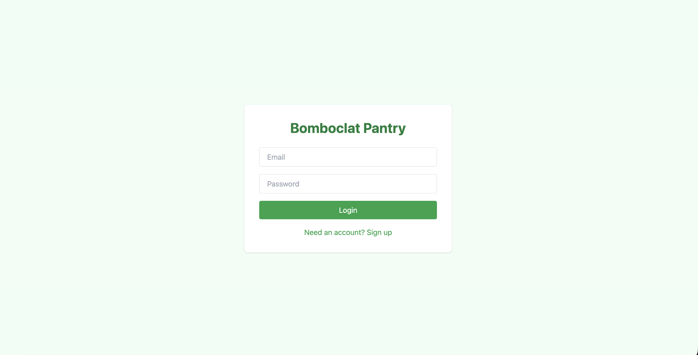

# Food Pantry

This repository contains a frontend (Vite + React) and a backend (FastAPI) for a simple AI powered food pantry app.

## Development

- Frontend: `frontend/` (run `npm install` then `npm run dev`)
- Backend: `backend/` (create and activate `.venv`, then `pip install -r requirements.txt` and `python main.py`)
